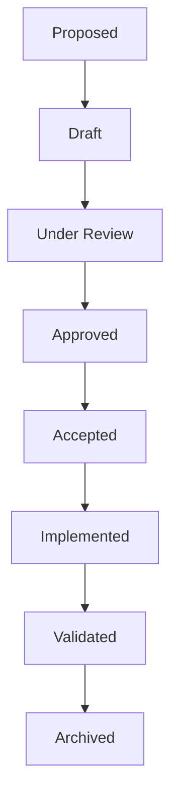
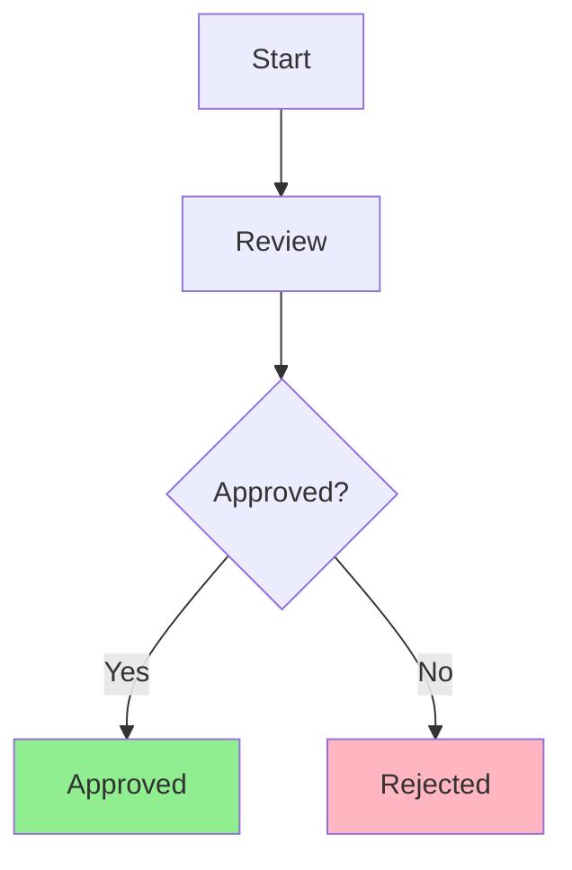
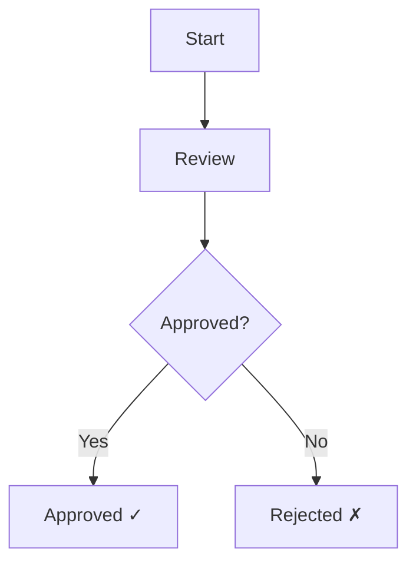

# ADR Accessibility Standards

> **Purpose**: Define accessibility standards for Architecture Decision Records, ensuring ADRs are accessible to all team members, including those with disabilities.

---

## Table of Contents

- [1. Overview](#1-overview)
- [2. Semantic Markdown Requirements](#2-semantic-markdown-requirements)
- [3. Heading Hierarchy](#3-heading-hierarchy)
- [4. Table Accessibility](#4-table-accessibility)
- [5. Diagram Accessibility](#5-diagram-accessibility)
- [6. Plain-Language Summaries](#6-plain-language-summaries)
- [7. Color-Independent Diagrams](#7-color-independent-diagrams)
- [8. Keyboard-Friendly Navigation](#8-keyboard-friendly-navigation)

---

## 1. Overview

### 1.1 Purpose

Accessible ADRs ensure that all team members can:

- **Read and understand** ADR content regardless of ability
- **Navigate** ADR documentation efficiently
- **Use assistive technologies** to access ADR information
- **Collaborate** on ADR reviews and approvals

### 1.2 Accessibility Principles

| Principle | Description |
|-----------|-------------|
| **Perceivable** | Information is presentable in ways all users can perceive |
| **Operable** | UI components are operable by all users |
| **Understandable** | Information and UI operation are understandable |
| **Robust** | Content is robust enough for diverse user agents |

### 1.3 Compliance Target

ADRs target **WCAG 2.1 Level AA** compliance for:

- Content structure
- Text alternatives
- Color usage
- Navigation
- Readability

---

## 2. Semantic Markdown Requirements

### 2.1 Document Structure

Every ADR must use semantic Markdown structure:

```markdown
# ADR-XXX: Title

## Status

[Status content]

## Context

[Context content]

## Decision

[Decision content]

## Rationale

[Rationale content]

## Consequences

[Consequences content]
```

### 2.2 Required Elements

| Element | Requirement | Example |
|---------|------------|---------|
| **Title** | Single H1 per document | `# ADR-001: Title` |
| **Sections** | H2 for main sections | `## Context` |
| **Subsections** | H3 for subsections | `### Advantages` |
| **Lists** | Proper list markup | `- Item` or `1. Item` |
| **Tables** | Proper table markup | See table guidelines |
| **Code** | Code blocks with language | ````python` |
| **Links** | Descriptive link text | `[Click here](url)` → `[ADR-001 details](url)` |

### 2.3 Text Formatting

| Format | Usage | Example |
|--------|-------|---------|
| **Bold** | Key terms, emphasis | `**Important**` |
| *Italic* | Titles, foreign words | `*Context*` |
| `Code` | Technical terms | `FastAPI` |
| ~~Strikethrough~~ | Removed content | `~~Old approach~~` |

### 2.4 List Guidelines

**Unordered lists** for items without order:

```markdown
- First item
- Second item
- Third item
```

**Ordered lists** for sequential steps:

```markdown
1. First step
2. Second step
3. Third step
```

**Nested lists** for hierarchy:

```markdown
- Parent item
  - Child item
  - Child item
- Parent item
  - Child item
```

### 2.5 Blockquote Guidelines

Use blockquotes for important information:

```markdown
> **Important**: This decision has significant security implications.

> **Note**: This section requires review from the security team.

> **Warning**: This change may break backward compatibility.
```

---

## 3. Heading Hierarchy

### 3.1 Heading Rules

| Rule | Description | Example |
|------|-------------|---------|
| **Single H1** | Only one H1 per document | `# ADR-001: Title` |
| **No skipped levels** | Never skip heading levels | H1 → H2 → H3 |
| **Sequential** | Headings in logical order | H1, H2, H3, H2, H3 |
| **Descriptive** | Headings describe content | `## Security Impact` not `## Details` |

### 3.2 Heading Structure Template

```markdown
# ADR-XXX: Title (H1)

## Status (H2)

## Context (H2)

### Background (H3)

### Current State (H3)

## Problem Statement (H2)

## Requirements (H2)

### Functional Requirements (H3)

### Non-Functional Requirements (H3)

## Considered Options (H2)

### Option 1: Name (H3)

#### Pros (H4)

#### Cons (H4)

### Option 2: Name (H3)

#### Pros (H4)

#### Cons (H4)

## Decision (H2)

## Rationale (H2)

## Consequences (H2)

### Positive (H3)

### Negative (H3)

### Mitigations (H3)
```

### 3.3 Heading Level Usage

| Level | Usage | Count |
|-------|-------|-------|
| H1 | Document title | 1 |
| H2 | Main sections | 8-12 |
| H3 | Subsections | 2-4 per H2 |
| H4 | Detailed breakdowns | 1-2 per H3 |
| H5 | Rarely used | Avoid if possible |
| H6 | Never used | Avoid |

### 3.4 Heading Validation

Check heading hierarchy with:

```bash
# Check heading hierarchy
python scripts/adr_checker.py --check-headings --adr ADR-001

# Check all ADRs
python scripts/adr_checker.py --check-headings --all
```

---

## 4. Table Accessibility

### 4.1 Table Structure

All tables must have:

1. **Header row**: Clear column headers
2. **Caption**: Table description (optional but recommended)
3. **Proper alignment**: Consistent column alignment
4. **Readable content**: No overly long cells

### 4.2 Table Template

```markdown
| Column 1 | Column 2 | Column 3 |
|----------|----------|----------|
| Cell 1   | Cell 2   | Cell 3   |
| Cell 4   | Cell 5   | Cell 6   |
```

### 4.3 Table Guidelines

| Guideline | Description | Example |
|-----------|-------------|---------|
| **Header row** | First row is always headers | `| Name | Status |` |
| **Alignment** | Left-align text, right-align numbers | `| --- | ---: |` |
| **Separators** | Use pipes and dashes | `| --- | --- |` |
| **Readability** | Keep cells concise | Use abbreviations if needed |
| **Accessibility** | Add caption if complex | `> Table: Comparison of options` |

### 4.4 Complex Tables

For complex tables, add a caption:

```markdown
> **Table 1**: Comparison of frontend frameworks

| Framework | Pros | Cons | Score |
|-----------|------|------|-------|
| React | Large ecosystem | Large bundle | 4/5 |
| Flutter | Native performance | Dart learning | 3/5 |
| Vue | Easy learning curve | Smaller ecosystem | 3/5 |
```

### 4.5 Table Validation

Check table accessibility with:

```bash
# Check table accessibility
python scripts/adr_checker.py --check-tables --adr ADR-001

# Check all ADRs
python scripts/adr_checker.py --check-tables --all
```

---

## 5. Diagram Accessibility

### 5.1 Diagram Requirements

All diagrams must have:

1. **Alt text**: Text alternative for screen readers
2. **Text description**: Detailed description of diagram content
3. **Color-independent**: Understandable without color
4. **Keyboard accessible**: Navigable without mouse

### 5.2 Alt Text Guidelines

| Diagram Type | Alt Text Format | Example |
|-------------|----------------|---------|
| **Flowchart** | Description of flow | "Flowchart showing ADR lifecycle from Proposed to Archived" |
| **Architecture** | Description of components | "Architecture diagram showing frontend, backend, and database components" |
| **Sequence** | Description of interactions | "Sequence diagram showing user authentication flow" |
| **State** | Description of states | "State diagram showing ADR status transitions" |

### 5.3 Text Description Template

```markdown


**Description**: This diagram shows [description of what the diagram represents].

**Key points**:
1. [Point 1]
2. [Point 2]
3. [Point 3]

**Legend**:
- [Color/Symbol] = [Meaning]
- [Color/Symbol] = [Meaning]
```

### 5.4 Mermaid Diagram Accessibility

For Mermaid diagrams, provide text alternatives:

````markdown


**Description**: This flowchart shows the ADR lifecycle. An ADR starts as Proposed, moves through Draft, Under Review, Approved, Accepted, Implemented, and Validated states before being Archived.
````

### 5.5 Diagram Validation

Check diagram accessibility with:

```bash
# Check diagram accessibility
python scripts/adr_checker.py --check-diagrams --adr ADR-001

# Check all ADRs
python scripts/adr_checker.py --check-diagrams --all
```

---

## 6. Plain-Language Summaries

### 6.1 Purpose

Every ADR must include a plain-language summary that:

- Uses simple, clear language
- Avoids jargon when possible
- Explains technical concepts
- Is understandable by non-technical stakeholders

### 6.2 Summary Placement

The plain-language summary is the **Decision Summary** section:

```markdown
## Decision Summary

In 1-2 sentences, state what was decided and why. This should be comprehensible without reading the full ADR.
```

### 6.3 Summary Guidelines

| Guideline | Description | Example |
|-----------|-------------|---------|
| **Simple language** | Use common words | "use" not "utilize" |
| **Active voice** | Subject performs action | "We chose..." not "It was chosen..." |
| **Short sentences** | Keep sentences under 25 words | Break complex sentences |
| **Technical terms** | Define when first used | "FastAPI (a Python web framework)" |
| **Concrete examples** | Use specific examples | "like React or Vue" not "like other frameworks" |

### 6.4 Summary Template

```markdown
## Decision Summary

We decided to use [Technology X] for [Purpose Y] because [Reason Z].

This means [impact on team/project] and [next steps].
```

### 6.5 Summary Examples

**Good summary**:

> We decided to use FastAPI for our backend API because it provides automatic documentation and fast performance. This means our team can develop APIs faster and users can understand our API without extra documentation.

**Bad summary**:

> We chose FastAPI over Django REST Framework due to its async capabilities and Pydantic integration, which will optimize our API's performance characteristics and reduce latency.

### 6.6 Summary Validation

Check summary accessibility with:

```bash
# Check summary readability
python scripts/adr_checker.py --check-readability --adr ADR-001

# Check all ADRs
python scripts/adr_checker.py --check-readability --all
```

---

## 7. Color-Independent Diagrams

### 7.1 Color Independence Requirements

Diagrams must be understandable without color:

| Requirement | Description |
|------------|-------------|
| **No color-only meaning** | Never use color as the only way to convey information |
| **Patterns/shapes** | Use patterns or shapes in addition to color |
| **Labels** | Label all diagram elements |
| **Legend** | Provide legend explaining symbols |

### 7.2 Pattern Usage

| Pattern | Usage | Example |
|---------|-------|---------|
| **Solid** | Primary path | Main workflow |
| **Dashed** | Secondary path | Alternative flow |
| **Dotted** | Future state | Planned changes |
| **Cross-hatch** | Deprecated | Removed items |

### 7.3 Shape Usage

| Shape | Usage | Example |
|-------|-------|---------|
| **Rectangle** | Process/step | "Review ADR" |
| **Diamond** | Decision | "Approved?" |
| **Oval** | Start/end | "Start" |
| **Parallelogram** | Input/output | "Submit ADR" |

### 7.4 Label Guidelines

| Guideline | Description | Example |
|-----------|-------------|---------|
| **Text labels** | Label all elements | "Approved" not just green |
| **Consistent naming** | Use same terms as ADR | "Under Review" not "In Review" |
| **Clear placement** | Labels near elements | Labels inside or adjacent |
| **Readable font** | Use readable font size | Minimum 12pt equivalent |

### 7.5 Color-Independent Diagram Example

**Before (color-dependent)**:



**After (color-independent)**:



### 7.6 Diagram Validation

Check diagram color independence with:

```bash
# Check diagram color independence
python scripts/adr_checker.py --check-color --adr ADR-001

# Check all ADRs
python scripts/adr_checker.py --check-color --all
```

---

## 8. Keyboard-Friendly Navigation

### 8.1 Navigation Requirements

ADR documentation must be navigable via keyboard:

| Requirement | Description |
|------------|-------------|
| **Tab order** | Logical tab order through content |
| **Skip links** | Links to skip repetitive content |
| **Focus visible** | Visible focus indicators |
| **No keyboard traps** | Can navigate away from all elements |

### 8.2 Skip Links

For multi-page ADR documentation, provide skip links:

```markdown
**Quick Navigation**:
- [Status](#status)
- [Context](#context)
- [Decision](#decision)
- [Rationale](#rationale)
- [Consequences](#consequences)
```

### 8.3 Link Guidelines

| Guideline | Description | Example |
|-----------|-------------|---------|
| **Descriptive text** | Links describe destination | "[See ADR-001](link)" not "[Click here](link)" |
| **Unique text** | Link text is unique | Different links have different text |
| **Understandable** | Link purpose is clear | "View implementation details" |
| **No generic text** | Avoid "click here", "read more" | Use specific descriptions |

### 8.4 Focus Management

For interactive ADR documentation:

| Element | Focus Behavior |
|---------|---------------|
| **Headings** | Focusable for screen readers |
| **Links** | Visible focus indicator |
| **Tables** | Navigate by cell |
| **Code blocks** | Readable without mouse |

### 8.5 Keyboard Testing

Test keyboard navigation with:

```bash
# Test keyboard navigation
python scripts/adr_checker.py --check-keyboard --adr ADR-001

# Check all ADRs
python scripts/adr_checker.py --check-keyboard --all
```

### 8.6 Screen Reader Testing

Test with screen readers:

| Screen Reader | Platform | Usage |
|--------------|----------|-------|
| **NVDA** | Windows | Free, open-source |
| **JAWS** | Windows | Commercial |
| **VoiceOver** | macOS | Built-in |
| **Orca** | Linux | Free, open-source |

---

## Appendix A: Accessibility Checklist

Before publishing an ADR, verify:

- [ ] Single H1 per document
- [ ] No skipped heading levels
- [ ] All tables have header rows
- [ ] All diagrams have alt text
- [ ] All diagrams have text descriptions
- [ ] Diagrams are color-independent
- [ ] Plain-language summary included
- [ ] Links are descriptive
- [ ] No generic link text
- [ ] Code blocks have language specified
- [ ] Blockquotes used for important info
- [ ] Lists use proper markup
- [ ] No content relies solely on color
- [ ] Keyboard navigation works

## Appendix B: Accessibility Testing Commands

| Command | Description |
|---------|-------------|
| `--check-headings` | Validate heading hierarchy |
| `--check-tables` | Validate table accessibility |
| `--check-diagrams` | Validate diagram accessibility |
| `--check-color` | Validate color independence |
| `--check-readability` | Validate plain-language summaries |
| `--check-keyboard` | Validate keyboard navigation |
| `--check-all` | Run all accessibility checks |

---

*Accessibility version: 1.0.0*
*Last updated: 2026-07-19*
*Next review: 2026-10-19*
