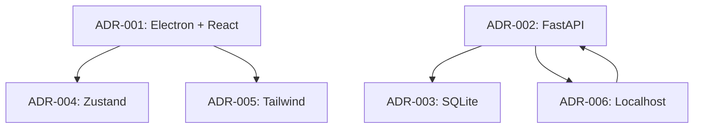

# ADR Automation Strategy

> **Purpose**: Define the automation strategy for Architecture Decision Records, including creation, validation, indexing, documentation generation, and CI/CD integration.

---

## Table of Contents

- [1. Overview](#1-overview)
- [2. ADR Creation Scripts](#2-adr-creation-scripts)
- [3. Link Validation](#3-link-validation)
- [4. Status Validation](#4-status-validation)
- [5. Metadata Validation](#5-metadata-validation)
- [6. Search Index Generation](#6-search-index-generation)
- [7. Documentation Generation](#7-documentation-generation)
- [8. Changelog Integration](#8-changelog-integration)
- [9. CI/CD Integration](#9-cicd-integration)

---

## 1. Overview

### 1.1 Purpose

Automation reduces manual effort, ensures consistency, and catches errors early in the ADR lifecycle.

### 1.2 Automation Principles

| Principle | Description |
|-----------|-------------|
| **Consistency** | Automated processes follow the same rules every time |
| **Speed** | Automation is faster than manual processes |
| **Accuracy** | Automation reduces human error |
| **Visibility** | Automation provides clear feedback |
| **Maintainability** | Automation scripts are version-controlled |

### 1.3 Automation Scope

| Area | Manual | Automated |
|------|--------|-----------|
| ADR creation | Author writes content | Template generation, numbering |
| ADR review | Reviewers read and comment | Link checking, validation |
| ADR approval | Approvers sign off | Status updates, notifications |
| ADR implementation | Developers write code | PR tracking, test verification |
| ADR archival | Archivist moves files | Checksum generation, backup |

---

## 2. ADR Creation Scripts

### 2.1 Number Assignment

**Script**: `scripts/adr_create.py`

**Purpose**: Automatically assign sequential ADR numbers.

**Usage**:

```bash
# Create new ADR with next available number
python scripts/adr_create.py --title "My New Decision"

# Create ADR with specific category
python scripts/adr_create.py --title "My New Decision" --category TECH

# Preview ADR number without creating
python scripts/adr_create.py --preview
```

**Behavior**:

1. Scan existing ADRs for highest number
2. Assign next sequential number
3. Generate filename from title
4. Create ADR file from template
5. Update ADR index

**Output**:

```
Created ADR-007: My New Decision
File: docs/adr/ADR-007-my-new-decision.md
Category: Technology Selection
Status: Proposed
```

### 2.2 Template Generation

**Script**: `scripts/adr_template.py`

**Purpose**: Generate ADR content from template with pre-filled metadata.

**Usage**:

```bash
# Generate ADR from template
python scripts/adr_template.py --number 7 --title "My Decision"

# Generate with custom metadata
python scripts/adr_template.py --number 7 --title "My Decision" --author @alice

# Generate for specific category
python scripts/adr_template.py --number 7 --title "My Decision" --category SEC
```

**Template Variables**:

| Variable | Description | Default |
|----------|-------------|---------|
| `{NUMBER}` | ADR number | Auto-assigned |
| `{TITLE}` | ADR title | Required |
| `{DATE}` | Creation date | Today |
| `{AUTHOR}` | Author name | Current user |
| `{CATEGORY}` | ADR category | Architecture |
| `{STATUS}` | Initial status | Proposed |

### 2.3 Bulk Creation

**Script**: `scripts/adr_bulk_create.py`

**Purpose**: Create multiple ADRs from a backlog file.

**Usage**:

```bash
# Create ADRs from backlog
python scripts/adr_bulk_create.py --backlog docs/adr/ADR_BACKLOG.md

# Create only high-priority ADRs
python scripts/adr_bulk_create.py --backlog docs/adr/ADR_BACKLOG.md --priority high

# Dry run
python scripts/adr_bulk_create.py --backlog docs/adr/ADR_BACKLOG.md --dry-run
```

### 2.4 Validation on Creation

Before creating an ADR, validate:

- [ ] Number is available
- [ ] Title is valid
- [ ] Category is valid
- [ ] Author has write access
- [ ] Template exists

---

## 3. Link Validation

### 3.1 Link Checker Script

**Script**: `scripts/adr_link_checker.py`

**Purpose**: Validate all links in ADRs.

**Usage**:

```bash
# Check all ADRs
python scripts/adr_link_checker.py --all

# Check specific ADR
python scripts/adr_link_checker.py --adr ADR-001

# Check only changed ADRs
python scripts/adr_link_checker.py --changed

# Check external links
python scripts/adr_link_checker.py --external

# Generate report
python scripts/adr_link_checker.py --report
```

### 3.2 Link Types Checked

| Link Type | Check Method | Failure Severity |
|-----------|-------------|-----------------|
| GitHub Issues | GitHub API | Error |
| GitHub PRs | GitHub API | Error |
| Commits | Git API | Error |
| Releases | GitHub API | Error |
| Internal Files | File system | Error |
| External URLs | HTTP HEAD request | Warning |
| Related ADRs | File system | Error |

### 3.3 Link Validation Rules

| Rule | Description | Action |
|------|-------------|--------|
| **Existence** | Link target exists | Error if missing |
| **Access** | Link target is accessible | Warning if inaccessible |
| **Format** | Link format is correct | Error if malformed |
| **Consistency** | Links are consistent | Warning if inconsistent |
| **Freshness** | Links are up-to-date | Info if outdated |

### 3.4 Link Validation Report

```markdown
# Link Validation Report

**Date**: 2026-07-19
**Scope**: All ADRs
**Total Links**: 42

## Summary

- Valid: 40 (95.2%)
- Invalid: 1 (2.4%)
- Warnings: 1 (2.4%)

## Invalid Links

| ADR | Link | Issue |
|-----|------|-------|
| ADR-003 | ISSUE-104 | Issue not found |

## Warnings

| ADR | Link | Issue |
|-----|------|-------|
| ADR-005 | URL-001 | External link may be outdated |

## Recommendations

1. Fix invalid link in ADR-003
2. Verify external link in ADR-005
```

---

## 4. Status Validation

### 4.1 Status Validator Script

**Script**: `scripts/adr_status_validator.py`

**Purpose**: Validate ADR status transitions follow lifecycle rules.

**Usage**:

```bash
# Validate all statuses
python scripts/adr_status_validator.py --all

# Validate specific ADR
python scripts/adr_status_validator.py --adr ADR-001

# Validate recent changes
python scripts/adr_status_validator.py --recent

# Generate report
python scripts/adr_status_validator.py --report
```

### 4.2 Status Transition Rules

| From | To | Allowed |
|------|----|---------| 
| Proposed | Draft | Yes |
| Proposed | Deprecated | Yes |
| Draft | Under Review | Yes |
| Draft | Deprecated | Yes |
| Under Review | Approved | Yes |
| Under Review | Draft | Yes |
| Under Review | Deprecated | Yes |
| Approved | Accepted | Yes |
| Approved | Superseded | Yes |
| Accepted | Implemented | Yes |
| Accepted | Superseded | Yes |
| Implemented | Validated | Yes |
| Implemented | Superseded | Yes |
| Implemented | Draft | Yes |
| Validated | Archived | Yes |
| Validated | Superseded | Yes |
| Validated | Implemented | Yes |
| Superseded | Archived | Yes |
| Deprecated | Archived | Yes |

### 4.3 Status Validation Rules

| Rule | Description | Action |
|------|-------------|--------|
| **Valid Transition** | Transition is allowed | Error if invalid |
| **Required Fields** | Required fields for status | Error if missing |
| **Approval Required** | Status requires approval | Error if not approved |
| **Time Limit** | Status within time limit | Warning if exceeded |
| **Dependencies** | Dependencies satisfied | Error if not satisfied |

### 4.4 Status Validation Report

```markdown
# Status Validation Report

**Date**: 2026-07-19
**Scope**: All ADRs
**Total ADRs**: 6

## Summary

- Valid: 6 (100%)
- Invalid: 0 (0%)
- Warnings: 1 (16.7%)

## Invalid Statuses

None.

## Warnings

| ADR | Status | Issue |
|-----|--------|-------|
| ADR-003 | Implemented | Exceeds time limit |

## Recommendations

1. Review ADR-003 implementation status
```

---

## 5. Metadata Validation

### 5.1 Metadata Validator Script

**Script**: `scripts/adr_metadata_validator.py`

**Purpose**: Validate ADR metadata is complete and correct.

**Usage**:

```bash
# Validate all metadata
python scripts/adr_metadata_validator.py --all

# Validate specific ADR
python scripts/adr_metadata_validator.py --adr ADR-001

# Validate required fields
python scripts/adr_metadata_validator.py --required-only

# Generate report
python scripts/adr_metadata_validator.py --report
```

### 5.2 Required Metadata Fields

| Field | Description | Validation |
|-------|-------------|------------|
| `ADR Number` | Sequential number | Format: `ADR-XXX` |
| `Title` | Short, descriptive title | Non-empty |
| `Status` | Current status | Valid status value |
| `Date` | Creation date | ISO 8601 format |
| `Authors` | List of authors | Non-empty list |
| `Reviewers` | List of reviewers | Non-empty list (for Under Review+) |
| `Approvers` | List of approvers | Non-empty list (for Approved+) |
| `Decision Summary` | 1-2 sentence summary | Non-empty |
| `Context` | Background section | Non-empty |
| `Problem Statement` | Problem definition | Non-empty |
| `Considered Options` | At least 3 options | Minimum 3 options |
| `Decision` | What was decided | Non-empty |
| `Rationale` | Why this option | Non-empty |

### 5.3 Metadata Validation Rules

| Rule | Description | Action |
|------|-------------|--------|
| **Required Fields** | All required fields present | Error if missing |
| **Field Format** | Fields follow format rules | Error if malformed |
| **Field Content** | Fields have meaningful content | Warning if too short |
| **Cross-References** | Related ADRs exist | Error if missing |
| **Date Validity** | Dates are valid | Error if invalid |

### 5.4 Metadata Validation Report

```markdown
# Metadata Validation Report

**Date**: 2026-07-19
**Scope**: All ADRs
**Total ADRs**: 6

## Summary

- Valid: 5 (83.3%)
- Invalid: 1 (16.7%)
- Warnings: 0 (0%)

## Invalid Metadata

| ADR | Field | Issue |
|-----|-------|-------|
| ADR-003 | Reviewers | Missing reviewer list |

## Recommendations

1. Add reviewer list to ADR-003
```

---

## 6. Search Index Generation

### 6.1 Search Index Script

**Script**: `scripts/adr_search_index.py`

**Purpose**: Generate search index for ADRs.

**Usage**:

```bash
# Generate search index
python scripts/adr_search_index.py --all

# Update search index
python scripts/adr_search_index.py --update

# Search ADRs
python scripts/adr_search_index.py --search "security"

# Generate report
python scripts/adr_search_index.py --report
```

### 6.2 Search Index Structure

```json
{
  "version": "1.0.0",
  "generated": "2026-07-19T00:00:00Z",
  "total_adrs": 6,
  "index": {
    "ADR-001": {
      "title": "Electron + React over Flutter",
      "status": "Accepted",
      "category": "Technology Selection",
      "keywords": ["frontend", "react", "electron", "flutter", "desktop"],
      "content_hash": "abc123..."
    },
    "ADR-002": {
      "title": "FastAPI over Django",
      "status": "Accepted",
      "category": "Technology Selection",
      "keywords": ["backend", "fastapi", "django", "python", "api"],
      "content_hash": "def456..."
    }
  }
}
```

### 6.3 Search Index Keywords

| ADR | Keywords |
|-----|----------|
| ADR-001 | frontend, react, electron, flutter, desktop, cross-platform |
| ADR-002 | backend, fastapi, django, python, api, async |
| ADR-003 | database, sqlite, postgresql, offline, local |
| ADR-004 | state, zustand, redux, react, management |
| ADR-005 | css, tailwind, styling, utility-first |
| ADR-006 | security, localhost, networking, isolation, privacy |

### 6.4 Search Index Report

```markdown
# Search Index Report

**Date**: 2026-07-19
**Total ADRs**: 6
**Total Keywords**: 30

## Keyword Distribution

| Category | Count | Keywords |
|----------|-------|----------|
| Technology | 12 | react, electron, fastapi, etc. |
| Architecture | 6 | frontend, backend, database, etc. |
| Security | 3 | security, localhost, isolation |
| UX | 3 | css, tailwind, styling |
| State | 2 | zustand, redux |
| Platform | 4 | desktop, cross-platform, offline, local |
```

---

## 7. Documentation Generation

### 7.1 Table of Contents Generator

**Script**: `scripts/adr_toc_generator.py`

**Purpose**: Generate table of contents for ADR documentation.

**Usage**:

```bash
# Generate TOC for all ADRs
python scripts/adr_toc_generator.py --all

# Generate TOC for specific ADR
python scripts/adr_toc_generator.py --adr ADR-001

# Update TOC
python scripts/adr_toc_generator.py --update
```

### 7.2 Dependency Graph Generator

**Script**: `scripts/adr_dependency_graph.py`

**Purpose**: Generate dependency graph for ADRs.

**Usage**:

```bash
# Generate dependency graph
python scripts/adr_dependency_graph.py --all

# Generate graph for specific ADR
python scripts/adr_dependency_graph.py --adr ADR-001

# Export as Mermaid
python scripts/adr_dependency_graph.py --format mermaid

# Export as DOT
python scripts/adr_dependency_graph.py --format dot
```

### 7.3 Dependency Graph Output



### 7.4 Summary Report Generator

**Script**: `scripts/adr_summary_report.py`

**Purpose**: Generate summary report of all ADRs.

**Usage**:

```bash
# Generate summary report
python scripts/adr_summary_report.py --all

# Generate by category
python scripts/adr_summary_report.py --category SECURITY

# Generate by status
python scripts/adr_summary_report.py --status Accepted

# Export as markdown
python scripts/adr_summary_report.py --format markdown

# Export as JSON
python scripts/adr_summary_report.py --format json
```

### 7.5 Summary Report Output

```markdown
# ADR Summary Report

**Date**: 2026-07-19
**Total ADRs**: 6

## By Status

| Status | Count | Percentage |
|--------|-------|------------|
| Accepted | 6 | 100% |
| Implemented | 0 | 0% |
| Validated | 0 | 0% |
| Superseded | 0 | 0% |
| Deprecated | 0 | 0% |
| Archived | 0 | 0% |

## By Category

| Category | Count | Percentage |
|----------|-------|------------|
| Technology Selection | 4 | 66.7% |
| Database Design | 1 | 16.7% |
| Security | 1 | 16.7% |

## Recent Activity

| ADR | Date | Activity |
|-----|------|----------|
| ADR-006 | 2026-03-15 | Created |
| ADR-005 | 2026-03-01 | Created |
| ADR-004 | 2026-02-15 | Created |
```

---

## 8. Changelog Integration

### 8.1 Changelog Generator Script

**Script**: `scripts/adr_changelog.py`

**Purpose**: Generate changelog entries from ADR changes.

**Usage**:

```bash
# Generate changelog for all ADRs
python scripts/adr_changelog.py --all

# Generate changelog for specific ADR
python scripts/adr_changelog.py --adr ADR-001

# Generate changelog for date range
python scripts/adr_changelog.py --from 2026-01-01 --to 2026-07-19

# Export as markdown
python scripts/adr_changelog.py --format markdown
```

### 8.2 Changelog Entry Format

```markdown
# ADR Changelog

## [1.0.0] - 2026-07-19

### Added

- ADR-001: Electron + React over Flutter
- ADR-002: FastAPI over Django
- ADR-003: SQLite over PostgreSQL
- ADR-004: Zustand over Redux
- ADR-005: Tailwind over CSS-in-JS
- ADR-006: Localhost-Only Security Model

### Changed

- None

### Deprecated

- None

### Removed

- None

### Fixed

- None

### Security

- None
```

### 8.3 Changelog Integration with Git

```bash
# Generate changelog from git history
python scripts/adr_changelog.py --git

# Generate changelog from commit messages
python scripts/adr_changelog.py --commits

# Generate changelog from PR titles
python scripts/adr_changelog.py --prs
```

---

## 9. CI/CD Integration

### 9.1 GitHub Actions Workflows

#### 9.1.1 ADR Check Workflow

```yaml
# .github/workflows/adr-check.yml
name: ADR Check
on:
  pull_request:
    paths:
      - 'docs/adr/**'

jobs:
  adr-check:
    runs-on: ubuntu-latest
    steps:
      - uses: actions/checkout@v3
      
      - name: Set up Python
        uses: actions/setup-python@v4
        with:
          python-version: '3.10'
      
      - name: Install dependencies
        run: pip install -r requirements-dev.txt
      
      - name: Validate ADR links
        run: python scripts/adr_link_checker.py --changed
      
      - name: Validate ADR status
        run: python scripts/adr_status_validator.py --changed
      
      - name: Validate ADR metadata
        run: python scripts/adr_metadata_validator.py --changed
      
      - name: Check ADR completeness
        run: python scripts/adr_completeness.py --changed
```

#### 9.1.2 ADR Merge Workflow

```yaml
# .github/workflows/adr-merge.yml
name: ADR Merge
on:
  push:
    branches:
      - main
    paths:
      - 'docs/adr/**'

jobs:
  adr-merge:
    runs-on: ubuntu-latest
    steps:
      - uses: actions/checkout@v3
      
      - name: Set up Python
        uses: actions/setup-python@v4
        with:
          python-version: '3.10'
      
      - name: Install dependencies
        run: pip install -r requirements-dev.txt
      
      - name: Full ADR validation
        run: python scripts/adr_link_checker.py --all
      
      - name: Update search index
        run: python scripts/adr_search_index.py --update
      
      - name: Generate documentation
        run: python scripts/adr_toc_generator.py --update
      
      - name: Generate changelog
        run: python scripts/adr_changelog.py --all
      
      - name: Upload artifacts
        uses: actions/upload-artifact@v3
        with:
          name: adr-artifacts
          path: |
            adr-search-index.json
            adr-changelog.md
```

#### 9.1.3 ADR Weekly Workflow

```yaml
# .github/workflows/adr-weekly.yml
name: ADR Weekly
on:
  schedule:
    - cron: '0 0 * * 0'  # Every Sunday at midnight

jobs:
  adr-weekly:
    runs-on: ubuntu-latest
    steps:
      - uses: actions/checkout@v3
      
      - name: Set up Python
        uses: actions/setup-python@v4
        with:
          python-version: '3.10'
      
      - name: Install dependencies
        run: pip install -r requirements-dev.txt
      
      - name: Full ADR validation
        run: python scripts/adr_link_checker.py --all
      
      - name: Check external links
        run: python scripts/adr_link_checker.py --external
      
      - name: Generate summary report
        run: python scripts/adr_summary_report.py --all
      
      - name: Generate audit report
        run: python scripts/adr_audit.py --all
      
      - name: Upload report
        uses: actions/upload-artifact@v3
        with:
          name: adr-weekly-report
          path: adr-report.md
```

### 9.2 Pre-commit Hooks

```yaml
# .pre-commit-config.yaml
repos:
  - repo: local
    hooks:
      - id: adr-link-check
        name: ADR Link Check
        entry: python scripts/adr_link_checker.py --changed
        language: system
        files: 'docs/adr/.*\.md$'
      
      - id: adr-status-check
        name: ADR Status Check
        entry: python scripts/adr_status_validator.py --changed
        language: system
        files: 'docs/adr/.*\.md$'
      
      - id: adr-metadata-check
        name: ADR Metadata Check
        entry: python scripts/adr_metadata_validator.py --changed
        language: system
        files: 'docs/adr/.*\.md$'
```

### 9.3 Script Requirements

```txt
# requirements-dev.txt
pytest>=7.0.0
pytest-cov>=4.0.0
pyyaml>=6.0
requests>=2.28.0
click>=8.0.0
rich>=12.0.0
```

### 9.4 Script Testing

```bash
# Run all ADR script tests
pytest tests/adr/

# Run specific test
pytest tests/adr/test_link_checker.py

# Run with coverage
pytest tests/adr/ --cov=scripts/adr_
```

---

## Appendix A: Automation Commands Reference

| Command | Description |
|---------|-------------|
| `adr_create.py` | Create new ADR |
| `adr_template.py` | Generate ADR from template |
| `adr_bulk_create.py` | Create multiple ADRs |
| `adr_link_checker.py` | Validate ADR links |
| `adr_status_validator.py` | Validate ADR status |
| `adr_metadata_validator.py` | Validate ADR metadata |
| `adr_search_index.py` | Generate search index |
| `adr_toc_generator.py` | Generate table of contents |
| `adr_dependency_graph.py` | Generate dependency graph |
| `adr_summary_report.py` | Generate summary report |
| `adr_changelog.py` | Generate changelog |
| `adr_completeness.py` | Check ADR completeness |
| `adr_audit.py` | Generate audit report |

---

*Automation version: 1.0.0*
*Last updated: 2026-07-19*
*Next review: 2026-10-19*
