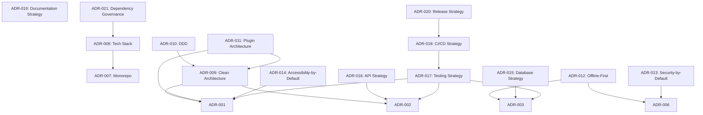

# ADR Backlog

> **Purpose**: Maintain a prioritized backlog of Architecture Decision Records to be created, ensuring comprehensive architectural documentation.

---

## Table of Contents

- [1. Overview](#1-overview)
- [2. Backlog Items](#2-backlog-items)
- [3. Prioritization](#3-prioritization)
- [4. Effort Estimation](#4-effort-estimation)
- [5. Acceptance Criteria](#5-acceptance-criteria)

---

## 1. Overview

### 1.1 Purpose

The ADR Backlog tracks:

- **Pending decisions**: ADRs that need to be created
- **Priority**: Order in which ADRs should be created
- **Effort**: Estimated effort for each ADR
- **Dependencies**: Relationships between ADRs
- **Status**: Current state of each backlog item

### 1.2 Backlog Principles

| Principle | Description |
|-----------|-------------|
| **Prioritized** | Items are ordered by importance |
| **Estimated** | Effort is estimated for each item |
| **Actionable** | Each item has clear acceptance criteria |
| **Current** | Backlog is updated regularly |
| **Transparent** | Priority and rationale are documented |

### 1.3 Backlog Management

| Role | Responsibility |
|------|---------------|
| **ADR Governor** | Maintain backlog, assign priorities |
| **Tech Lead** | Review priorities, approve assignments |
| **Team Members** | Create ADRs from backlog |
| **Stakeholders** | Provide input on priorities |

---

## 2. Backlog Items

### 2.1 ADR-007: Monorepo Strategy

| Field | Value |
|-------|-------|
| **Title** | Monorepo Strategy |
| **Status** | Backlog |
| **Priority** | High |
| **Category** | Architecture |
| **Estimated Effort** | Medium (1-2 weeks) |
| **Dependencies** | None |

**Summary**: Decide on monorepo vs. polyrepo strategy for AuthShield Lab, including tooling, organization, and cross-package dependencies.

**Acceptance Criteria**:

- [ ] Problem statement clearly defined
- [ ] At least 3 options evaluated (monorepo, polyrepo, hybrid)
- [ ] Tooling options evaluated (Nx, Turborepo, Lerna, etc.)
- [ ] Cross-package dependency management addressed
- [ ] Build and test strategy documented
- [ ] Security implications assessed
- [ ] Performance implications assessed
- [ ] Migration strategy defined

---

### 2.2 ADR-008: Technology Stack Selection

| Field | Value |
|-------|-------|
| **Title** | Technology Stack Selection |
| **Status** | Backlog |
| **Priority** | High |
| **Category** | Technology Selection |
| **Estimated Effort** | Medium (1-2 weeks) |
| **Dependencies** | ADR-001, ADR-002, ADR-003 |

**Summary**: Consolidate and document the complete technology stack decisions, including frontend, backend, database, and supporting technologies.

**Acceptance Criteria**:

- [ ] Complete technology stack documented
- [ ] All technology decisions linked to ADRs
- [ ] Version pinning strategy defined
- [ ] Update strategy documented
- [ ] License compliance addressed
- [ ] Security implications assessed
- [ ] Performance implications assessed
- [ ] Team expertise requirements documented

---

### 2.3 ADR-009: Clean Architecture Adoption

| Field | Value |
|-------|-------|
| **Title** | Clean Architecture Adoption |
| **Status** | Backlog |
| **Priority** | High |
| **Category** | Architecture |
| **Estimated Effort** | High (2-3 weeks) |
| **Dependencies** | ADR-001, ADR-002 |

**Summary**: Decide on architectural pattern (Clean Architecture, Hexagonal, Onion, etc.) for organizing code structure and dependencies.

**Acceptance Criteria**:

- [ ] Architectural pattern options evaluated
- [ ] Layer boundaries defined
- [ ] Dependency rules documented
- [ ] Testability implications assessed
- [ ] Maintainability implications assessed
- [ ] Team adoption strategy defined
- [ ] Migration strategy documented
- [ ] Examples provided

---

### 2.4 ADR-010: Domain-Driven Design

| Field | Value |
|-------|-------|
| **Title** | Domain-Driven Design |
| **Status** | Backlog |
| **Priority** | Medium |
| **Category** | Domain Modeling |
| **Estimated Effort** | High (2-3 weeks) |
| **Dependencies** | ADR-009 |

**Summary**: Decide on Domain-Driven Design approach, including bounded contexts, aggregates, and domain events.

**Acceptance Criteria**:

- [ ] DDD approach options evaluated
- [ ] Bounded contexts identified
- [ ] Aggregate design documented
- [ ] Domain events cataloged
- [ ] Anti-corruption layers defined
- [ ] Ubiquitous language documented
- [ ] Persistence strategy addressed
- [ ] Team training plan defined

---

### 2.5 ADR-011: Plugin Architecture

| Field | Value |
|-------|-------|
| **Title** | Plugin Architecture |
| **Status** | Backlog |
| **Priority** | Medium |
| **Category** | Plugin Framework |
| **Estimated Effort** | High (2-3 weeks) |
| **Dependencies** | ADR-001, ADR-009 |

**Summary**: Decide on plugin architecture for extensibility, including extension points, hooks, and plugin APIs.

**Acceptance Criteria**:

- [ ] Plugin architecture options evaluated
- [ ] Extension points defined
- [ ] Hook system documented
- [ ] Plugin API designed
- [ ] Security implications assessed
- [ ] Performance implications assessed
- [ ] Plugin distribution strategy defined
- [ ] Plugin testing strategy documented

---

### 2.6 ADR-012: Offline-First Design

| Field | Value |
|-------|-------|
| **Title** | Offline-First Design |
| **Status** | Backlog |
| **Priority** | Medium |
| **Category** | Architecture |
| **Estimated Effort** | Medium (1-2 weeks) |
| **Dependencies** | ADR-003, ADR-006 |

**Summary**: Decide on offline-first design approach, including data synchronization, conflict resolution, and offline capabilities.

**Acceptance Criteria**:

- [ ] Offline-first approach options evaluated
- [ ] Data synchronization strategy defined
- [ ] Conflict resolution strategy documented
- [ ] Offline capabilities listed
- [ ] Data integrity approach documented
- [ ] Performance implications assessed
- [ ] User experience implications assessed
- [ ] Testing strategy defined

---

### 2.7 ADR-013: Security-by-Default

| Field | Value |
|-------|-------|
| **Title** | Security-by-Default |
| **Status** | Backlog |
| **Priority** | High |
| **Category** | Security |
| **Estimated Effort** | Medium (1-2 weeks) |
| **Dependencies** | ADR-006 |

**Summary**: Define security-by-default principles and practices, including secure coding standards, input validation, and security controls.

**Acceptance Criteria**:

- [ ] Security principles documented
- [ ] Secure coding standards defined
- [ ] Input validation strategy documented
- [ ] Security controls cataloged
- [ ] Threat model documented
- [ ] Security testing strategy defined
- [ ] Security training plan defined
- [ ] Compliance requirements addressed

---

### 2.8 ADR-014: Accessibility-by-Default

| Field | Value |
|-------|-------|
| **Title** | Accessibility-by-Default |
| **Status** | Backlog |
| **Priority** | High |
| **Category** | Accessibility |
| **Estimated Effort** | Medium (1-2 weeks) |
| **Dependencies** | ADR-001 |

**Summary**: Define accessibility-by-default principles and practices, including WCAG compliance, assistive technology support, and accessibility testing.

**Acceptance Criteria**:

- [ ] Accessibility principles documented
- [ ] WCAG compliance level defined
- [ ] Assistive technology requirements documented
- [ ] Accessibility testing strategy defined
- [ ] Accessibility audit process defined
- [ ] Team training plan defined
- [ ] Accessibility tools selected
- [ ] Accessibility metrics defined

---

### 2.9 ADR-015: Database Strategy

| Field | Value |
|-------|-------|
| **Title** | Database Strategy |
| **Status** | Backlog |
| **Priority** | Medium |
| **Category** | Database Design |
| **Estimated Effort** | Medium (1-2 weeks) |
| **Dependencies** | ADR-003 |

**Summary**: Define comprehensive database strategy, including schema design, indexing, migrations, and data management.

**Acceptance Criteria**:

- [ ] Schema design strategy documented
- [ ] Indexing strategy defined
- [ ] Migration strategy documented
- [ ] Backup strategy defined
- [ ] Recovery strategy documented
- [ ] Performance implications assessed
- [ ] Security implications assessed
- [ ] Data archival strategy defined

---

### 2.10 ADR-016: API Strategy

| Field | Value |
|-------|-------|
| **Title** | API Strategy |
| **Status** | Backlog |
| **Priority** | Medium |
| **Category** | API Design |
| **Estimated Effort** | Medium (1-2 weeks) |
| **Dependencies** | ADR-002 |

**Summary**: Define comprehensive API strategy, including design principles, versioning, documentation, and testing.

**Acceptance Criteria**:

- [ ] API design principles documented
- [ ] API style defined (REST, GraphQL, etc.)
- [ ] Versioning strategy defined
- [ ] Documentation strategy documented
- [ ] Testing strategy defined
- [ ] Security implications assessed
- [ ] Performance implications assessed
- [ ] SDK impact assessed

---

### 2.11 ADR-017: Testing Strategy

| Field | Value |
|-------|-------|
| **Title** | Testing Strategy |
| **Status** | Backlog |
| **Priority** | High |
| **Category** | Testing |
| **Estimated Effort** | Medium (1-2 weeks) |
| **Dependencies** | ADR-001, ADR-002, ADR-003 |

**Summary**: Define comprehensive testing strategy, including unit, integration, E2E, performance, security, and accessibility testing.

**Acceptance Criteria**:

- [ ] Testing pyramid documented
- [ ] Unit testing strategy defined
- [ ] Integration testing strategy defined
- [ ] E2E testing strategy defined
- [ ] Performance testing strategy defined
- [ ] Security testing strategy defined
- [ ] Accessibility testing strategy defined
- [ ] Test automation strategy defined

---

### 2.12 ADR-018: CI/CD Strategy

| Field | Value |
|-------|-------|
| **Title** | CI/CD Strategy |
| **Status** | Backlog |
| **Priority** | Medium |
| **Category** | CI/CD |
| **Estimated Effort** | Medium (1-2 weeks) |
| **Dependencies** | ADR-017 |

**Summary**: Define comprehensive CI/CD strategy, including pipeline design, deployment, automation, and monitoring.

**Acceptance Criteria**:

- [ ] Pipeline design documented
- [ ] Build strategy defined
- [ ] Test automation strategy defined
- [ ] Deployment strategy defined
- [ ] Rollback strategy documented
- [ ] Monitoring strategy defined
- [ ] Alerting strategy defined
- [ ] Security implications assessed

---

### 2.13 ADR-019: Documentation Strategy

| Field | Value |
|-------|-------|
| **Title** | Documentation Strategy |
| **Status** | Backlog |
| **Priority** | Medium |
| **Category** | Documentation |
| **Estimated Effort** | Low (1 week) |
| **Dependencies** | None |

**Summary**: Define comprehensive documentation strategy, including standards, tools, formats, and processes.

**Acceptance Criteria**:

- [ ] Documentation standards defined
- [ ] Documentation tools selected
- [ ] Documentation formats defined
- [ ] Documentation review process defined
- [ ] Documentation deployment strategy defined
- [ ] Documentation maintenance strategy defined
- [ ] Accessibility implications assessed
- [ ] Translation strategy defined

---

### 2.14 ADR-020: Release Strategy

| Field | Value |
|-------|-------|
| **Title** | Release Strategy |
| **Status** | Backlog |
| **Priority** | Medium |
| **Category** | Release Engineering |
| **Estimated Effort** | Low (1 week) |
| **Dependencies** | ADR-018 |

**Summary**: Define comprehensive release strategy, including versioning, channels, distribution, and rollback.

**Acceptance Criteria**:

- [ ] Versioning strategy defined
- [ ] Release channels defined
- [ ] Distribution strategy documented
- [ ] Rollback strategy documented
- [ ] Communication strategy defined
- [ ] Testing strategy defined
- [ ] Security implications assessed
- [ ] Monitoring strategy defined

---

### 2.15 ADR-021: Dependency Governance

| Field | Value |
|-------|-------|
| **Title** | Dependency Governance |
| **Status** | Backlog |
| **Priority** | Medium |
| **Category** | Dependency Management |
| **Estimated Effort** | Low (1 week) |
| **Dependencies** | ADR-008 |

**Summary**: Define dependency governance strategy, including updates, audits, supply chain security, and license compliance.

**Acceptance Criteria**:

- [ ] Update strategy defined
- [ ] Audit process documented
- [ ] Supply chain security addressed
- [ ] License compliance documented
- [ ] Pinning strategy defined
- [ ] Monitoring strategy defined
- [ ] Incident response plan documented
- [ ] Training plan defined

---

## 3. Prioritization

### 3.1 Priority Levels

| Priority | Description | Timeframe |
|----------|-------------|-----------|
| **Critical** | Must be done immediately | 1-2 weeks |
| **High** | Should be done soon | 2-4 weeks |
| **Medium** | Important but not urgent | 1-3 months |
| **Low** | Nice to have | 3-6 months |
| **Deferred** | Will be done eventually | 6+ months |

### 3.2 Priority Matrix

| ADR | Priority | Rationale |
|-----|----------|-----------|
| ADR-007 | High | Foundational architecture decision |
| ADR-008 | High | Consolidates existing decisions |
| ADR-009 | High | Core architectural pattern |
| ADR-010 | Medium | Depends on ADR-009 |
| ADR-011 | Medium | Important for extensibility |
| ADR-012 | Medium | Important for offline support |
| ADR-013 | High | Critical for security |
| ADR-014 | High | Critical for accessibility |
| ADR-015 | Medium | Important for data management |
| ADR-016 | Medium | Important for API design |
| ADR-017 | High | Critical for quality |
| ADR-018 | Medium | Important for delivery |
| ADR-019 | Medium | Important for knowledge sharing |
| ADR-020 | Medium | Important for distribution |
| ADR-021 | Medium | Important for security |

### 3.3 Dependency Graph

---

## 4. Effort Estimation

### 4.1 Estimation Scale

| Effort | Description | Timeframe |
|--------|-------------|-----------|
| **Low** | Simple decision, few options | < 1 week |
| **Medium** | Moderate complexity, multiple options | 1-2 weeks |
| **High** | Complex decision, many options | 2-3 weeks |
| **Very High** | Very complex, significant research | 3+ weeks |

### 4.2 Effort Estimates

| ADR | Effort | Rationale |
|-----|--------|-----------|
| ADR-007 | Medium | Multiple options, clear criteria |
| ADR-008 | Medium | Consolidation of existing decisions |
| ADR-009 | High | Complex architectural pattern |
| ADR-010 | High | Complex domain modeling |
| ADR-011 | High | Complex extensibility design |
| ADR-012 | Medium | Clear offline-first patterns |
| ADR-013 | Medium | Well-established security practices |
| ADR-014 | Medium | Well-established accessibility practices |
| ADR-015 | Medium | Well-established database practices |
| ADR-016 | Medium | Well-established API practices |
| ADR-017 | Medium | Well-established testing practices |
| ADR-018 | Medium | Well-established CI/CD practices |
| ADR-019 | Low | Documentation is straightforward |
| ADR-020 | Low | Release practices are well-defined |
| ADR-021 | Low | Dependency practices are well-defined |

### 4.3 Total Effort

| Category | ADRs | Total Effort |
|----------|------|--------------|
| Architecture | 4 | 8-10 weeks |
| Technology | 2 | 2-4 weeks |
| Security | 2 | 2-4 weeks |
| Accessibility | 1 | 1-2 weeks |
| Testing | 1 | 1-2 weeks |
| CI/CD | 1 | 1-2 weeks |
| Documentation | 1 | 1 week |
| Release | 1 | 1 week |
| Dependencies | 1 | 1 week |
| **Total** | **15** | **18-28 weeks** |

---

## 5. Acceptance Criteria

### 5.1 Standard Acceptance Criteria

All ADRs must meet these standard acceptance criteria:

- [ ] Problem statement is clear and concise
- [ ] At least 3 options are documented
- [ ] Trade-offs are explicitly stated
- [ ] Security impact is assessed
- [ ] Accessibility impact is assessed
- [ ] Risks are documented with mitigations
- [ ] Related ADRs are linked
- [ ] Documentation impact is assessed

### 5.2 Category-Specific Acceptance Criteria

| Category | Additional Criteria |
|----------|-------------------|
| **Architecture** | Pattern documentation, migration strategy |
| **Technology** | License compliance, community health |
| **Security** | Threat model, security controls |
| **Accessibility** | WCAG compliance, testing strategy |
| **Database** | Schema documentation, backup strategy |
| **API** | Contract documentation, versioning strategy |
| **Testing** | Test pyramid, automation strategy |
| **CI/CD** | Pipeline documentation, rollback strategy |
| **Documentation** | Standards, tools, maintenance strategy |
| **Release** | Versioning, channels, distribution |
| **Dependencies** | Update strategy, audit process |

### 5.3 Quality Gates

| Gate | Criteria | Owner |
|------|----------|-------|
| **Gate 1** | Template compliance | ADR Author |
| **Gate 2** | Technical accuracy | ADR Reviewer |
| **Gate 3** | Security review | Security Lead |
| **Gate 4** | Accessibility review | A11y Lead |
| **Gate 5** | Final approval | ADR Approver |

---

## Appendix A: Backlog Maintenance

### Update Schedule

| Activity | Frequency | Owner |
|----------|-----------|-------|
| **Priority review** | Weekly | ADR Governor |
| **Effort estimation** | Bi-weekly | Tech Lead |
| **Dependency review** | Monthly | ADR Governor |
| **Full backlog review** | Quarterly | Team |

### Backlog Metrics

| Metric | Target |
|--------|--------|
| **Backlog size** | < 20 items |
| **High priority items** | < 5 |
| **Overdue items** | 0 |
| **Unestimated items** | 0 |

---

*Backlog version: 1.0.0*
*Last updated: 2026-07-19*
*Next review: 2026-10-19*
